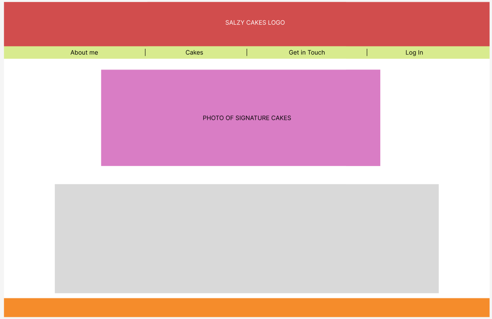
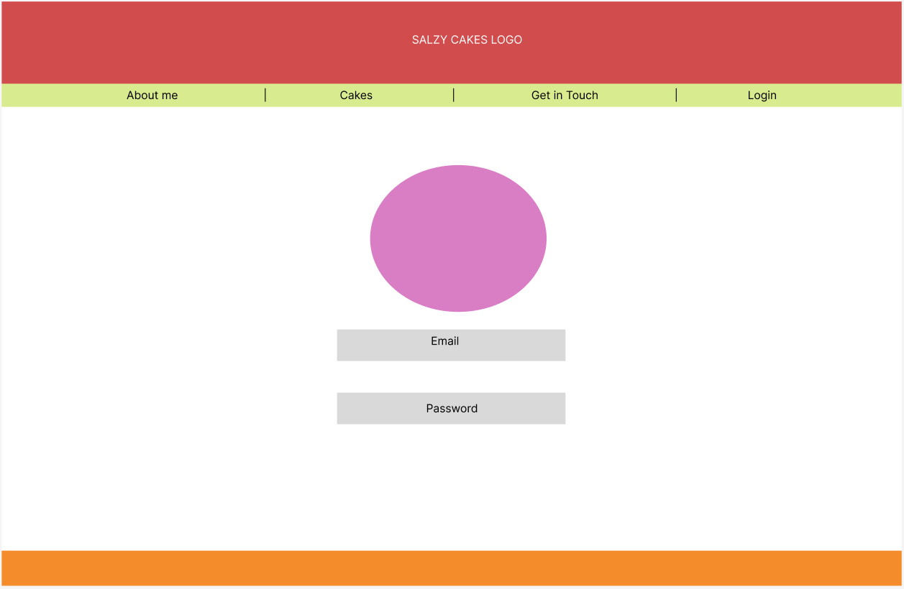
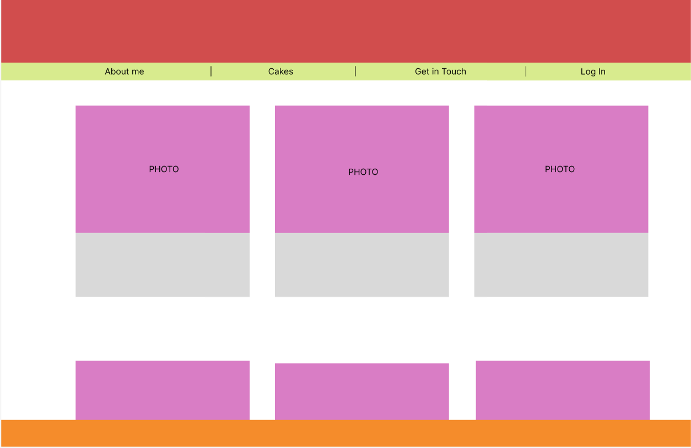
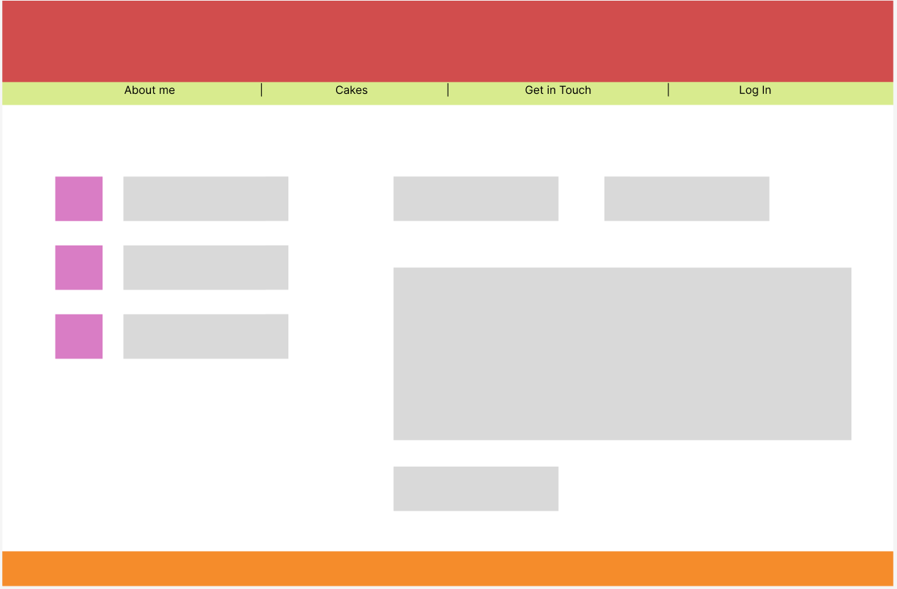
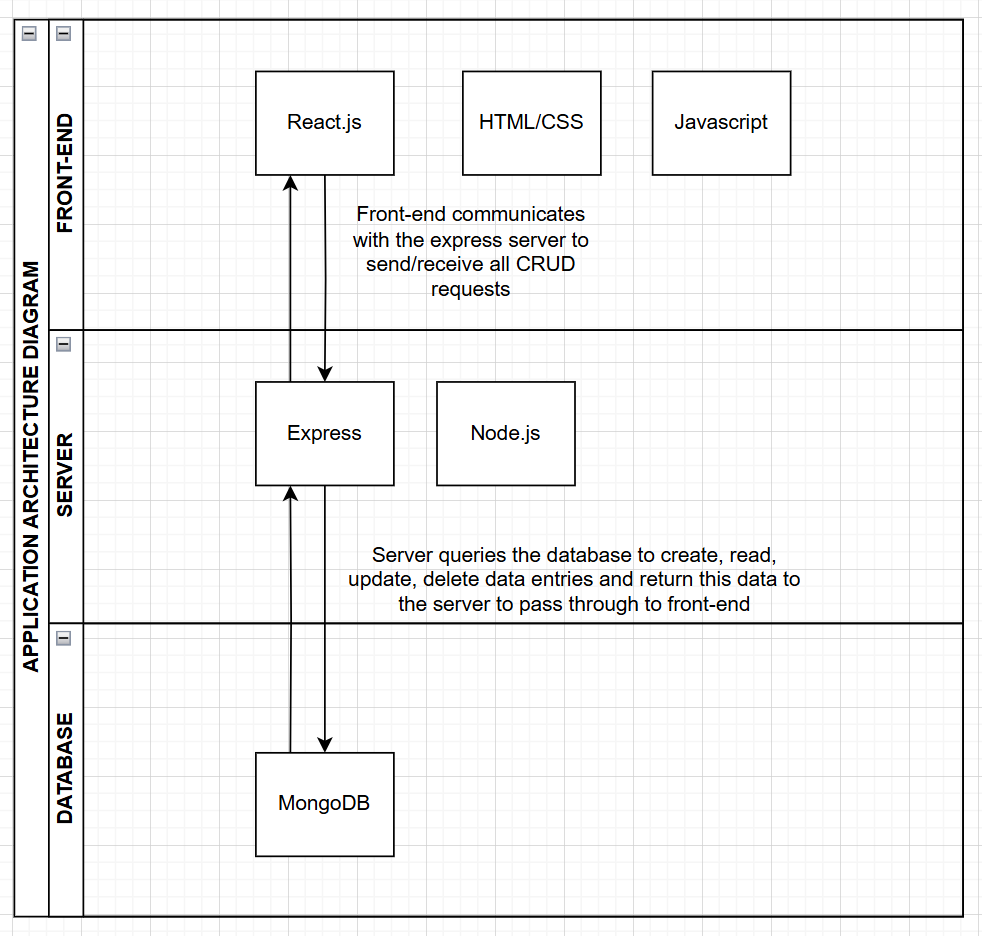
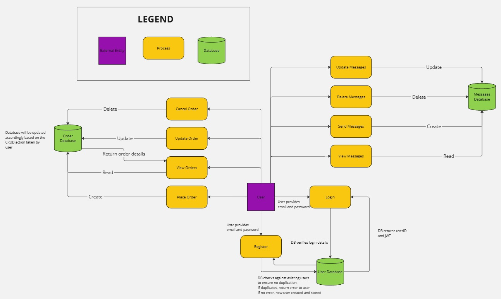
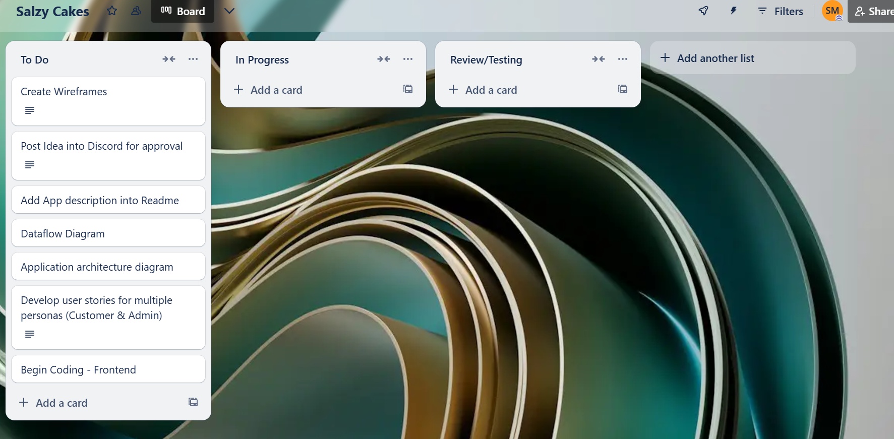
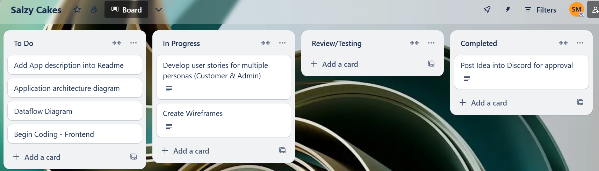
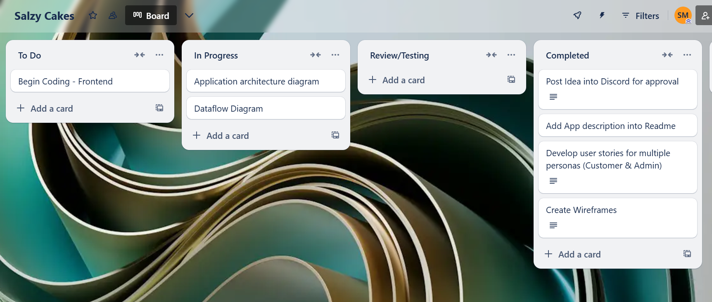

# Salzy Cakes - Term 3 Coder Academy Assignment

## Purpose

Salzy Cakes is a small business based in Melbourne selling customisable baked goods - specifically cakes!

After speaking with the business we have identified a few challenges in which a web app could help:

1. Currently they market products and connect with customers via Facebook and Instagram. While this is so far effective, they are then required to manage the orders on a separate excel sheet manually which can prove time consuming and subject to errors when dealing with lots of orders. Main functionality of the web app is to include a storefront which showcases all products and allows users to place orders directly and have this data organised in a relevant database.

2. Personal customisations - A big sell point for Salzy cakes is their ability to customise cakes to their cstomer's preferences. As such, we need to ensure the ordering process includes a free text field in which customer's can add a description of what sort of customisation is required (eg. Gender reveal filling,  themed decorations)

3. Centralised communication - Managing communications between FB and Instagram can get messy, so in addition to placing orders we would like to add a thread within an order which will allow both Sally (Owner) and customers to communicate with each other. This will ensure all comms can take place in a central repository

4. Customer Data - Another challenge is Salzy cakes posts monthly special cakes but she has no way of capturing customer details (mobile, email) in which she can send out monthly marketing to attract return sales. Having this order system on the web app will also require some login authentication so users will need to sign up when making a purchase to allocate the order to them. This will also allow Sally to capture details for future marketing.

The features of this application will be the solutions to the challenges discussed above.

## Target Audience

The target audience for this application would be any customer looking to purchase a cake for an event that they would like customised to match a specific theme or event. There is no specific gender or age related demographic.

Some suggestions which will also be included in our user stories include:

- Customers looking for a gender reveal cake which requires specific coloured fillings
- Birthday cakes with personalised messaging
- Cake customised for a specific theme such as a "Winnie the Pooh" themed cake

The possibilities are endless however the request needs to be reasonable and achievable within given time frames. This is why it is important to include the free-text communcation field between the customer and owner to ensure all details are captured in the order. 

## Tech Stack

This will be a MERN project, so we will be utilising the following tech stack:

- **MongoDB** - Mongo for the back-end database
- **Express** - Back-end framework for building API's with NodeJS
- **React** - To handle all our front-end development
- **NodeJS** - To assist with server side functions

## User Stories

User stories are created to ensure that the features we develop within our app serve a purpose and that this purpose is understood across the whole development team. This ensure that everything is tailored to solve issues that we expect users of our app to encounter. 

Below are some user stories provided to cover use cases from the perspective of a customer and an admin in relation to our key app features which include:

- A static and rotational menu
- Personal account login
- Placing an order with pre-defined customised options
- Free-text communication for updates on placed orders

### Customer

- As a customer, I want to be able to view the full static and rotational menu, so that I can decide what I want to order
- As a customer, I want to be able to create an account, so that I can review my existing/previous orders
- As a customer, I want to be able to fully customise my order, so that it can match a specific theme for my event
- As a customer, I want to be able to communicate directly with the service team so that I can update my order when and if necessary.
- As a customer, I want to be able to update my profile details incase something changes such as my address

### Admin

- As an admin, I want to be able to update my menu to include any seasonal or promotional changes
- As an amin, I want to be able to view all placed customer orders to help me keep track of what needs to be delivered
- As an admin, I want to be able to communicate with customers directly incase I require additional information to meet their customisation requests
- As an admin I want to be able to update order status to effectively manage my deliveries

## Wireframes

I have creted a view for the pages on my web app, starting with MVP pages which are required for the key feature of a customer placing an order to Salzy Cakes.

#### Home Page

 

Landing page for all users. This will provide highlights on seasonal menu and information about the business in text

#### Login

Login page to login to an existing account or register for a new account

#### Products

products page with full overview of menu

#### Products - Ordering

Specific product page to place order

#### Contact 

Contact page including social media links. Also will include a comms free text box to allow customers to send customised messages

## Application Architecture Diagram

## Dataflow Diagram

## Trello Board

To manage the tasks within this project, I will be using a Trello board to track tasks and monitor completion of these tasks. 

You can access my Trello board [Here](https://trello.com/b/dS3Sozzf/salzy-cakes)

